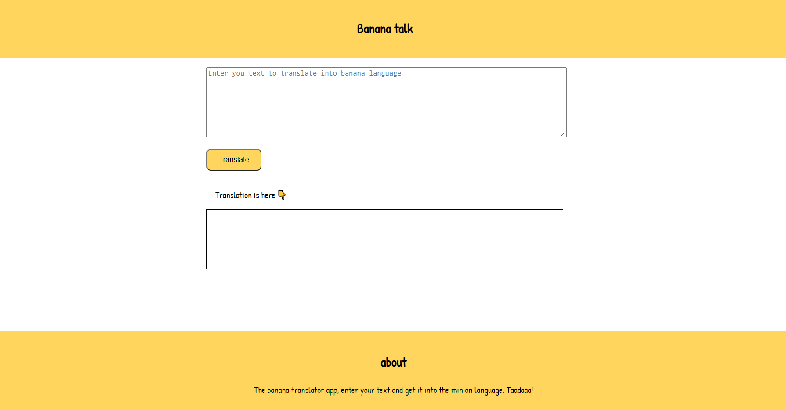

# **Banana Translator App**
This is a Banana translator app.
The app asks user to input text and then translates it to minion language, that is banana language.

---

## **Interface of the app**

---

## **How to use the app**
1. Enter your text in the input field.
2. Click on the translate button to get the translation.

---

## **Built using**
1. HTML
2. CSS
3. Javascript.

## **Link of the app**

[Banana Transalator app](https://rohitbananatalk.netlify.app/)
